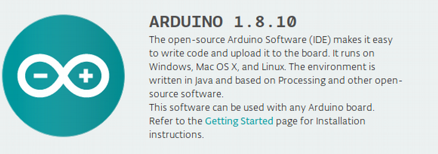

### Programming with Arduino



#### Setting up Arduino for ESP32

**Step 1: Download and Install the IDE**

The Arduino Software (IDE) allows you to write programs and upload them to your HealthyPiv4. Now you require Arduino Desktop IDE. You can download the latest version for Windows, Linux and Mac OS using the below link.
[Download the Arduino IDE](https://www.arduino.cc/en/Main/Software#download)

**Note**: Once you have downloaded, install the IDE and ensure that you enable most (if not all) of the options, including the drivers. Click for installing instructions in [windows](https://www.arduino.cc/en/guide/windows), [linux](https://www.arduino.cc/en/guide/linux), [Mac OS](https://www.arduino.cc/en/guide/macOSX)

**Step 2: Get the HealthyPi v4 COM Port Number**

Next, you will need to connect the HealthyPi v4 board to a system. This is done via a USB connection. When the HealthyPi v4 is connected, the operating system should recognize the board as a generic COM port. The easiest way to do this is to type **Device manager** into Windows Search and select Device Manager when it shows.

In the Device Manager window, look for a device under Ports (COM & LPT) and chances are the Arduino will be the only device on the list.

**Step 3: Configure the IDE**

Now we have determined the COM port of the HealthyPiv4, its time to load the Arduino IDE and configure it to use the same device and port. You have to install the esp32 platform in the Arduino IDE to find an esp32 board in board manager. For installing esp32 platform follow up the link:

[Installing ESP32 Platform in Boards Manager](https://github.com/espressif/arduino-esp32/blob/master/docs/arduino-ide/boards_manager.md)

You can start by loading the IDE. When it is loaded, navigate to **Tools > Board > Esp32 dev module**.

Next, you must tell the IDE which COM port the HealthyPi v4 is on. To do this, navigate to **Tools > Port > COMXX**. Obviously, if your HealthyPi v4 is on a different port, select that port instead.

**Step 4: Uploading code to HealthyPi v4**

A header file is generally used to define all the functions, variables and constants contained in any function library. Pin configuration can be done based on sensors. Download [Protocentral_HealthyPiv4 firmware](https://github.com/Protocentral/Protocentral_HealthyPiv4) and open it in the Arduino IDE's menu:**File > Open > Protocentral_HealthyPiv4**.

##### * Include the Protocentral_HealthyPiv4 library

```c
#include "Protocentral_HealthyPiv4.h"

```
##### * Initializing the functionalities in HealthyPi v4
```c
void setup()
{
  Serial.begin(115200);

  if(Healthypi_Mode == WEBSERVER_MODE){
    Serial.println("Starts in webserver mode");
    HealthyPiV4_Webserver_Init();
  }

  else if(Healthypi_Mode == V3_MODE){
  Serial.println("Starts in v3 mode");
  }

  else{
  Serial.println("Starts in BLE mode");
  HealthyPiV4_BLE_Init();
  }

 }
```
##### * In the loop function below we read the vitals data from HealthyPi v4 .

```c
void loop()
{

  Heart Rate = (uint8_t) global_HeartRate;

  Respiration Rate = (uint8_t) global_RespirationRate;

  sp02 = (uint8_t)afe44xx_raw_data.spo2;

  temperature =  (uint16_t) tempSensor.getTemperature();

}
```  

**Step 5: Uploading SPIFFS data folder**

Next, after uploading the code to Healthypi v4 you will need to upload the Spiffs data folder for getting the webpages and storing the SSID and Password. Download [ESP32 File system](https://github.com/me-no-dev/arduino-esp32fs-plugin.git), unzip the folder in Arduino IDE tools folder and  open the Arduino IDE ,navigate to **Tools>ESP32 Sketch Data Upload.


**Step 6: Compiling and Uploading**

Compile the code and check for compilation without error and upload the code to HealthyPi v4 and see the output in the mode of your choice.
