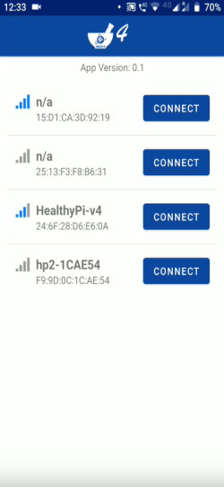
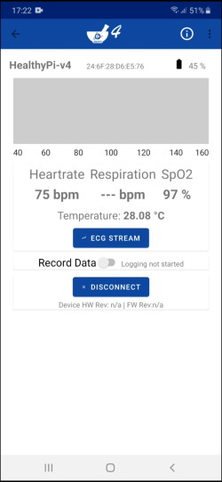
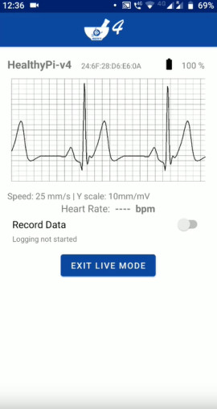

### HealthyPi with BLE

HealthyPi v4 is powered by the ESP32 SoC module, which supports pairing with smartphones through BLE. BLE is widely used in wearable devices because its low power requirements allow it to function for a long time without charging. HealthyPi v4 also supports pairing with other IoT devices for use in mesh networks. BLE 4.2 adds improved security capabilities.

Data measured by Healthy Pi v4 is accessible through standard BLE services for Heart Rate, Pulse Oximeter, Health Thermometer and Battery Service, as well as custom services for ECG and respiration. Notifications are used to transmit data from HealthyPi to the app.

<table class="tg">
  <tr>
    <th class="tg-s268">
Service Name
</th>
    <th class="tg-nk0m">UUID</th>

  </tr>
  <tr>
    <td class="tg-baqh">Heart Rate Service</td>
    <td class="tg-baqh">0x180D</td>

  </tr>
  <tr>
    <td class="tg-baqh">Pulse Oximetry Service</td>
    <td class="tg-baqh">0x1822</td>

  </tr>
  <tr>
    <td class="tg-baqh">Health Thermometer Service</td>
    <td class="tg-baqh">0x1809</td>

  </tr>
  <tr>
    <td class="tg-baqh">Battery Service</td>
    <td class="tg-baqh">0x180F</td>

  </tr>
</table>

#### Introducing the HealthyPi app

Monitoring the human physiological data associated with day-to-day activities becomes much simpler with the HealthyPi app, which is available in app stores, for both Android and iOS devices.

The HealthyPi app is used to communicate directly with HealthyPi v4 hardware, through the same BLE services mentioned above, and can display all vital signs on a single screen.

    

HealthyPi v4 is a powerful tool, and the HealthyPi app opens up new possibilities for using it to monitor vital signs outside of traditional settings. Among other features, it is capable of displaying respiration and ECG data. A simulation of the latter function is shown below:

#### Getting HealthyPi app

**1.** Download the HealthyPi v4 application for Android available on Google Play Store.

**2.** Connect the HealthyPi v4 device with mobile application through BLE.
