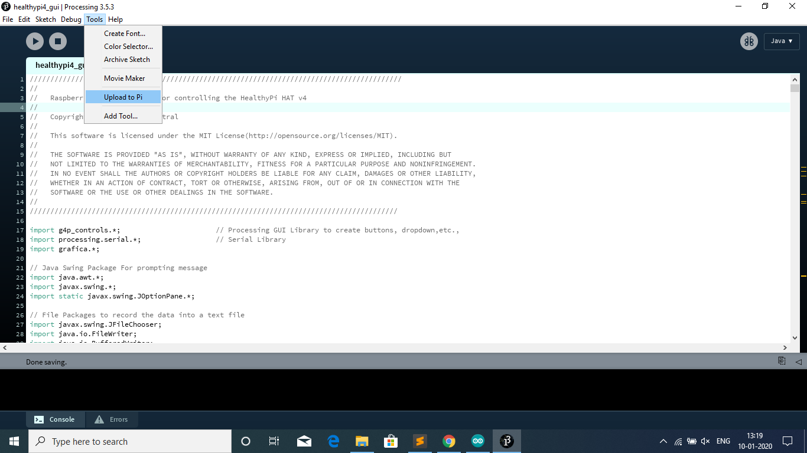

### Advanced HealthyPi

This section is for those who want to do a manual installation of HealthyPi, those who want to modify with the code and generally play with the hardware.

For the simple way to setup HealthyPi on Raspberry Pi,
The following are the steps involved to get Raspberry Pi ready for a wireless remote patient monitor.

#### Step 1 : Install and Update the OS

**->** Install the [Raspbian Buster with desktop and recommended software](https://www.raspberrypi.org/downloads/raspbian/) OS in Raspberry Pi.The image file can be downloaded from the [Raspberry Pi’s official website.](https://www.raspberrypi.org/documentation/installation/installing-images/README.md)

**->** Once the installation finishes, update the system with the following command in the Terminal:

```c

sudo apt-get update
sudo apt-get upgrade

```
#### Step 2 : Setting it Up

**->** Run the following command for setting up

```c

sudo nano /boot/config.tx

```
**->** Add this line to the end of the file
```c

dtoverlay=pi3-disable-bt

```
#### Step 3 : Launching the HealthyPi application

**->** open up the terminal window (Menu -> Accessories -> Terminal) on Raspbian running on your Raspberry Pi:

In the terminal window, type the following commands.

```bash

 curl -sS http://pi.protocentral.com/hpi3.sh | sudo bash

```

### HealthyPi GUI based on Processing

The HealthyPi visualization software  has been developed using the [Processing](https://processing.org/).
Processing is a Java-based open source framework. The following are the steps to get the visualization software ready for wireless remote patient monitor:

#### Step 1 : Download Processing IDE for your HOST COMPUTER operating system

a. Latest Version of the Processing IDE can be downloaded from the following link:

[Download Processing](https://processing.org/download/?processing)

b. Unzip and install the file once downloaded.

#### Step 2 : Download the Processing code for the HealthyPi GUI

a. Download the necessary files & directories or clone to your desktop from [HealthyPi v4 GitHub repository](https://github.com/Protocentral/protocentral_healthypiv4/tree/master/gui-software/healthypi4_gui).

b. Unzipping the archive should make a folder by name **"protocentral_healthypiv4"** that contains the visualisation code.

c. Locate the Processing sketchbook directory on your computer. This should have been created automatically when you installed processing. Depending on your operating system, the path will be as follows:
```c
    On Windows : C:/My Documents/Processing
    On MAC : /Users/your_user_name/Documents/Processing
    On Linux : /Home/your_user_name/sketchbook/
```
**Note:** This directory appears as **“Processing”** on Windows/Mac, and goes by the name “Sketchbook” on Linux. Create a subdirectory by name “libraries if one doesn’t exist already.

d. From the above mentioned **“protocentral_healthypiv4”** directory Copy/Move the contents of the HealthyPi/Processing/HealthyPi folder to the Processing sketchbook directory which is also mentioned above (Locate the Processing sketchbook)

e. Finally, copy the “controlP5 & G4P” folders from HealthyPi/Processing/libraries/ and paste them into the libraries directory of your Processing sketchbook.

#### Step 3 : Upload the Processing code Raspberry Pi

**1.** In Processing IDE, Select “Tools” from the menu and choose, “Add tools”.

**2.** Select **“Upload To Pi”** tool and click Install button which is present in the button right corner as shown in the below image.

**3.** Now, connect your raspberry pi to the internet with the same network as your laptop is connected.

**4.** Select “Tools” menu and choose “Upload to Pi” option from the list.



**5.** If any error occured in uploading the code, check for the internet connection and repeat the process.
