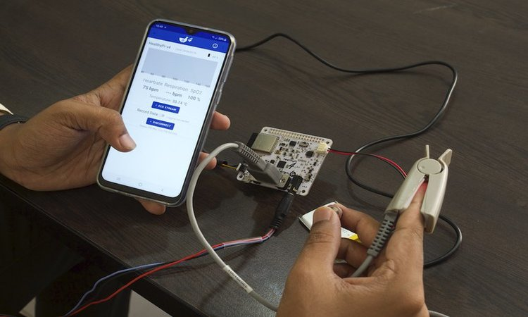
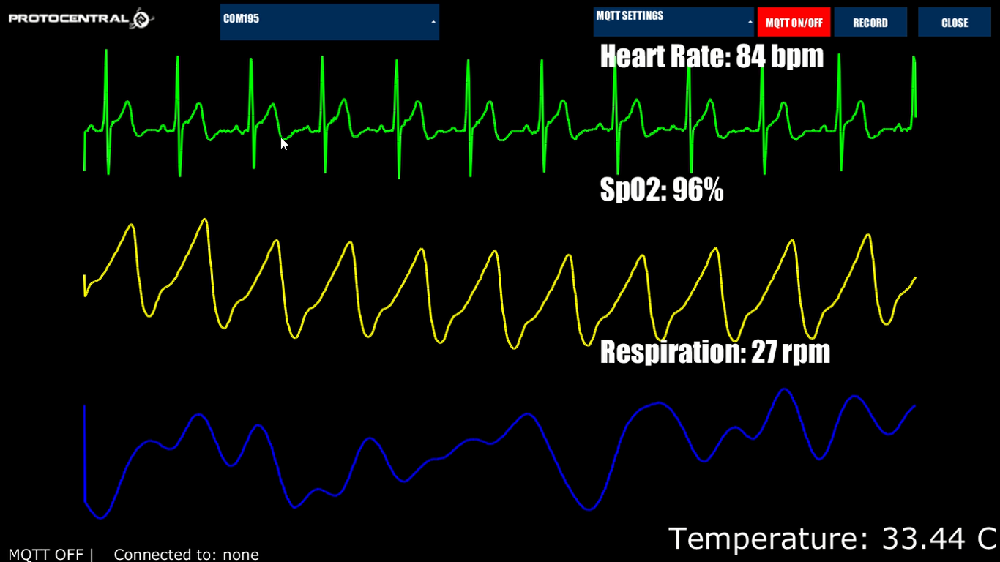

## Welcome to HealthyPi v4

### Looking for HealthyPi v3 Documentation ?, [check healthypi3.protocentral.com](http://healthypi3.protocentral.com/)

HealthyPi v4 sets a new standard in open source health solutions with mobility, wireless and wearable capabilities. It enables the continuous real-time monitoring of human physiological data, which provides a snapshot of the user's medical condition within his/her environment and also medical research possibilities. It is comfortable to wear and does not restrict the user's freedom of movement and can also act as a battery powered standalone device.

HealthyPi v4 measures the following parameters in real-time and with high accuracy:

* Electrocardiogram (ECG) data, heart rate, and heart-rate variability
* Respiration based on Impedance Pneumography
* Pulse oximetry (SPo2)
* Body temperature

HealthyPi v4 is affordable and accessible and the open source aspect means that it’s easy to expand on.
You can now purchase a HealthyPi v4 from [Crowd Supply](https://www.crowdsupply.com/protocentral/healthypi-v4-unplugged)

### Features
**Microcontroller and wireless connectivity:**  ESP32, in WROOM32 module format, with Dual-core Xtensa 32-bit CPU, 4 MB of on-board flash, Wi-Fi, and support for BLE.

**Wireless interface:**  Wi-Fi and Access Point (AP) modes, a 2.4 GHz radio with an on-board PCB antenna that is compatible with Bluetooth 4.2 and BLE.

**Firmware programming:** Supports Arduino IDE as well as Espressif ESP-IDF.

**Sensors:**
ECG and respiration front end: Texas Instruments (TI) ADS1292R 24-bit analog front end with signal-to-noise ratio (SNR) of 107 dB
Pulse oximetry front end: TI AFE4400 pulse oximetry front end with integrated LED driver and 22-bit ADC.

**Temperature sensor:** Maxim MAX30205 digital body temperature sensor for monitoring skin temperature.

**Form factor:** Raspberry Pi HAT form factor (65 mm X 56 mm).

### Ports and interfaces

* **On / Off Switch :** Powering the HealthyPi v4
* **USB-CDC :** On-board USB-TO-UART converter
* **2x Sparkfun QWIIC:** I2C compatible ports for interfacing any QWIIC based sensors and actuators
* **Sliding switch :** Transition between two different modes(HPi3 mode and Wearable mode).
* **On-board 3 LED :** Power indication and Modes indication
* **Push-button :** Switching between Communication Protocols(BLE and Webserver)

### Multiple operating modes, no programming required

#### [Wearable mode](https://healthypi.protocentral.com/HealthyPiv4_with_BLE.html)

The device communicates to android app via BLE. The real time vital signs (heart rate, respiration rate, spo2 and body temperature, histogram, heart rate variability) along with device battery level can be monitored from the Android mobile application. Additionally, you can also view live streaming of ECG. Added on-board power source (Battery) enhances the device to be used in a complete wearable platform. This mode also contains the [HealthyPi Webserver](https://healthypi.protocentral.com/HealthyPiv4_webserver.html).The HealthyPi v4 webserver page displays live monitoring of physiological data. Additionally with added on OTA updates feature, you can easily update the firmware in minutes.

#### [Raspberry Pi "HAT" mode (HealthyPi v3 compatible)](https://healthypi.protocentral.com/setting%20up%20complete%20kit.html)

Using the Raspberry Pi as its computing and display platform, the HealthyPi v4 add-on HAT turns the Raspberry Pi into a vital sign monitoring system, fully compatible with HealthyPi 3.The included GUI displays ECG, respiration and PPG waveforms and their calculated rate values along with temperature can be  streamed live through Raspberry Pi display or Computer monitor depending on the user's choice. The user can also record the data for research and analysis.
